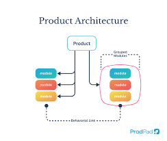

# Product Documentation

- Maintainable in version control
- Convertible to PDF, HTML, and PPTX
- Author: Technical Writer
- Contact: 23f3004490@ds.study.iitm.ac.in

---

# Common Issues

- Images Not Loading
  - Use relative paths
  - `--allow-local-files` for PDF export
- Font Problems
  - Include web fonts
  - Test custom fonts in PDF
- Build Errors
  - Check Node.js version
  - Verify dependencies
  - Use `--verbose` flag

---

# Keyboard Shortcuts

**In VS Code Marp Preview:**
- F1 → "Marp: Toggle Preview"
- Ctrl+Shift+V (Preview)
- Ctrl+K V (Side Preview)

**In Presentation Mode:**
- F (Fullscreen)
- P (Presenter View)
- B (Blackout)

---

# Algorithmic Complexity

$$
T(n) = O(n \log n)
$$

Where:
- \( T(n) \) is the runtime complexity
- \( n \) is input size

---

# Styling and Assets

- Optimize images before including
- Use consistent slide layout and branding

---

# Background Slide

# Welcome to our Product!

Enjoy minimal, responsive documentation.

---

# Thank You

Contact: 23f3004490@ds.study.iitm.ac.in

---

<!-- _footer: 23f3004490@ds.study.iitm.ac.in _paginate: true -->
